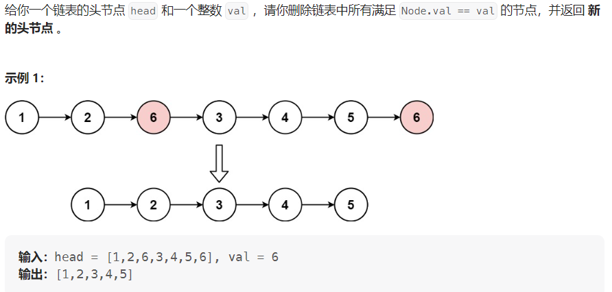

#### [203. 移除链表元素](https://leetcode.cn/problems/remove-linked-list-elements/)

#### 考点：链表

#### 难度：简单

#### 题面：

#### 思路：

```java
 public static class ListNode
 {
     int val;
     ListNode next;
     ListNode() {}
     ListNode(int val) { this.val = val; }
     ListNode(int val, ListNode next) { this.val = val; this.next = next; }
 }
```

1. 不加虚拟头节点：

   ```java
   public static ListNode removeElements_2(ListNode head, int val)
   {
       if(head==null) return head;
       while(head!=null && head.val==val)
           head = head.next;
       ListNode cur = head; //此时cur.val肯定不等于val
       while(cur!=null)
       {
           while(cur.next!=null && cur.next.val==val)
               cur.next = cur.next.next;
           cur = cur.next;
       }
       return head;
   }
   ```

   

2. **添加虚拟头节点**：

   

   ```java
   public static ListNode removeElements(ListNode head, int val)
   {
       if(head==null) return head;
       ListNode dummy = new ListNode(-1,head);
       ListNode pre = dummy;
       ListNode cur = head;
       while(cur!=null)
       {
           if(cur.val==val)
           {
               pre.next = cur.next;
           }
           else
               pre = cur;
           cur = cur.next;
       }
       return dummy.next;
   }
   ```


#### [2487. 从链表中移除节点](https://leetcode.cn/problems/remove-nodes-from-linked-list/)

#### 考点：链表

#### 难度：中等

#### 题面：

#### 思路：

```java

```

