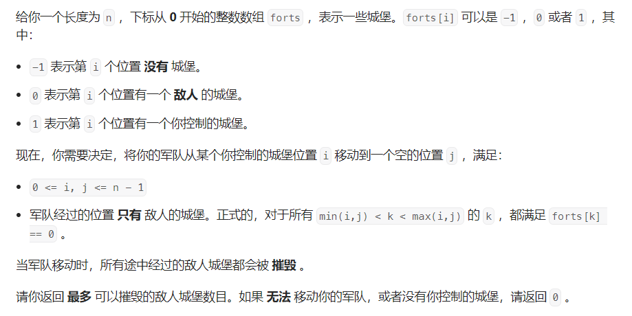
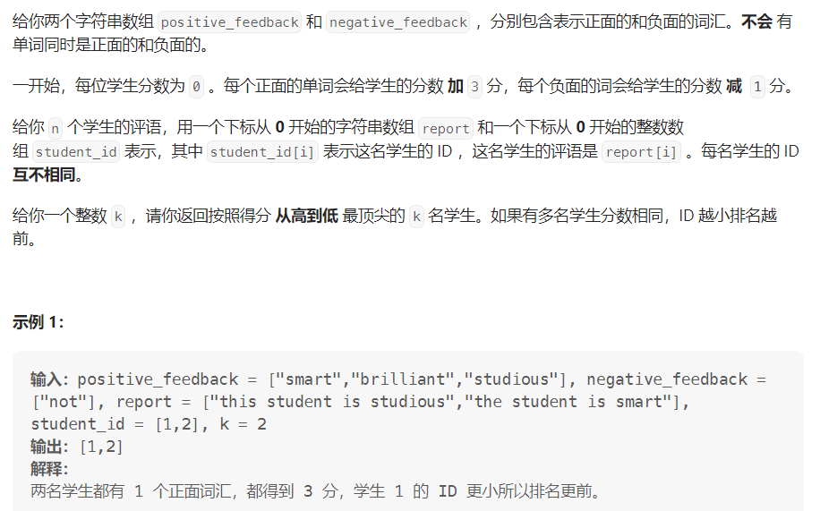
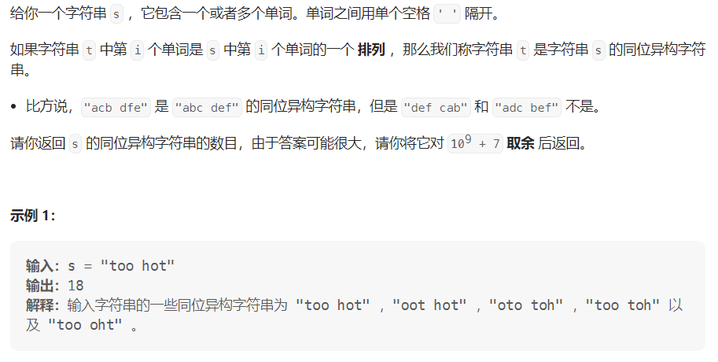

#### [2511. 最多可以摧毁的敌人城堡数目](https://leetcode.cn/problems/maximum-enemy-forts-that-can-be-captured/)

#### 考点：模拟

#### 难度：简单

#### 题面：

#### 思路：

理解题目意思后，可以将本题转换为求给定的数组中**1和-1之间连续0的最大数目**。

多个连续0可能是**1起始，-1结束**，即如`[1,0,0,.0,-1]`,也可能是**-1起始，1结束**，即如`[-1,0,0,..,0,1]`，因此：

- 使用变量`pos`和`neg`分别记录1和-1出现的下标，变量`isPos`和`isNeg`分别来记录1和-1是否出现过，`true`表示出现；
- 当1和-1都出现过，即可进行答案的更新，因为不知道谁在前，因此使用`Math.abs()`计算绝对值；
- 此段连续0的结束标志着下一段的开始，当当前位置为1时，表明1为下一段的起始，等待-1的出现，则将`isNeg`置为`false`；当前位置为-1时，同理；
- 当遍历完数组`forts`，返回结果。

```java
public int captureForts(int[] forts) {
    int ans = 0;
    //1和-1连续0的个数
    int pos = -1, neg = -1;
    boolean isPos = false, isNeg = false;
    for(int i = 0;i < forts.length;i++){
        if(forts[i] == 1){
            pos = i;
            isPos = true;
        }else if(forts[i] == -1){
            neg = i;
            isNeg = true;
        }
        if(isPos && isNeg){
            ans = Math.max(ans, Math.abs(pos - neg) - 1);
            if(forts[i] == 1)
                isNeg = false;
            else  if(forts[i] == -1)
                isPos = false;
        }
    }
    return ans;
}
```


#### [2512. 奖励最顶尖的 K 名学生](https://leetcode.cn/problems/reward-top-k-students/)

#### 考点：模拟

#### 难度：中等

#### 题面：

#### 思路：

这题题意非常好理解，根据题意模拟就好——根据每名学生的评语计算其得分，并从高到低排序。

- 由于对于每个评语，需要判断其中的单词是正面还是负面，因此使用数据结构`set`存储正面词汇和负面词汇；
- 使用数据结构`Map`存储学生id与其分数，`key`为id，`value`为分数；
- 根据`value`由高到低进行排序，若`value`一样，则根据`key`升序排序；
- 输出`map`中前K个`key`，即为要奖励的K位学生id。

```java
public List<Integer> topStudents(String[] positive_feedback, String[] negative_feedback, String[] report, int[] student_id, int k) {
    Set<String> pos = new HashSet<>();
    Set<String> neg = new HashSet<>();
    for(String str : positive_feedback)
        pos.add(str);
    for(String str : negative_feedback)
        neg.add(str);
    Map<Integer, Integer> map = new HashMap<>();
    for(int i = 0;i < student_id.length;i++){
        int score = 0;
        String[] rep = report[i].split(" ");
        for(String word : rep){
            if(pos.contains(word))
                score += 3;
            else if(neg.contains(word))
                score -= 1;
        }
        map.put(student_id[i],score);
    }
    //获取entrySet
    Set<Map.Entry<Integer, Integer>> mapEntries = map.entrySet();
    //使用链表来对集合进行排序，使用LinkedList，利于插入元素
    List<Map.Entry<Integer, Integer>> result = new LinkedList<>(mapEntries);
    //自定义比较器来比较链表中的元素
    Collections.sort(result, new Comparator<Map.Entry<Integer, Integer>>() {
        //基于entry的值（Entry.getValue()），来排序链表
        @Override
        public int compare(Map.Entry<Integer, Integer> o1, Map.Entry<Integer, Integer> o2) {
            int compare = o2.getValue().compareTo(o1.getValue());
            if (compare == 0) {
                return o1.getKey().compareTo(o2.getKey());
            } else {
                return compare;
            }
        }
    });
    int tmp = 0;
    List<Integer> ans = new ArrayList<>();
    for (Map.Entry<Integer, Integer> newEntry : result) {
        if(tmp < k){
            ans.add(newEntry.getKey());
            tmp++;
        }
    }
    return ans;
}
```


#### [2514. 统计同位异构字符串数目](https://leetcode.cn/problems/count-anagrams/)

#### 题面：

- 这一题是一道数论题目，暂时就不考虑了；

- 对于求阶乘，使用数组避免多次重复运算(动态规划那味)；

- `python`提供了求组合的函数**`comb()`**。