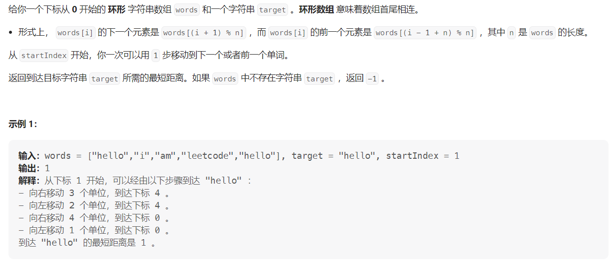
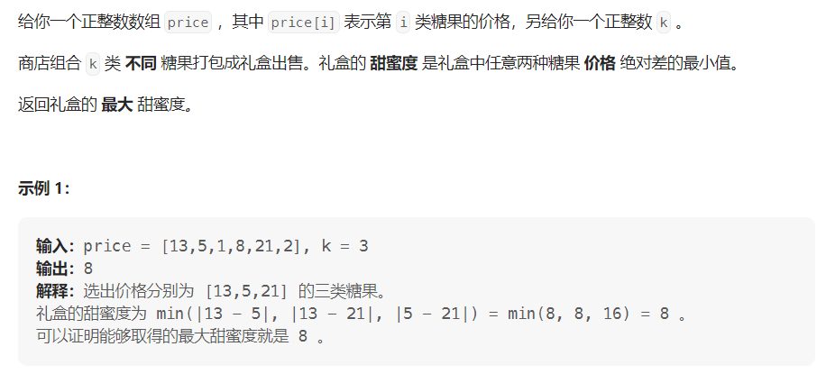

#### [2515. 到目标字符串的最短距离](https://leetcode.cn/problems/shortest-distance-to-target-string-in-a-circular-array/)

#### 考点：模拟

#### 难度：简单

#### 题面：

#### 思路：

由于是环形数组，因此可以从`startIndex`开始分别向后找和向前找，然后统计各自的距离，最后返回两者的最小值。

- 向后找和向前找都需要找`len`次
  - 向后找的下标为**`(i+startIndex) % len`**，注意取模操作；
  - 向前找的下标为**`(startIndex-i+len) % len`**。
- 最后如果`cnt1==len && cnt2==len`，说明向前找和向后找都没有找到`target`，返回`-1`。

```java
public int closetTarget(String[] words, String target, int startIndex) {
    int len = words.length;
    int cnt1 = 0, cnt2 = 0;
    //往后找
    for(int i = 0;i < len;i++){
        int index1 = (i+startIndex) % len;
        if(words[index1].equals(target))
            break;
        else {
            cnt1++;
        }
    }
    // 往前找
    for(int i = 0;i < len;i++){
        int index2 = (startIndex-i+len) % len;
        if(words[index2].equals(target))
            break;
        else {
            cnt2++;
        }
    }
    return (cnt1==len && cnt2==len) ? -1 : Math.min(cnt1, cnt2);
}
```


#### [2517. 礼盒的最大甜蜜度](https://leetcode.cn/problems/maximum-tastiness-of-candy-basket/)

#### 考点：二分查找

#### 难度：中等

#### 题面：

#### 思路：

相同的题目: [1552. 两球之间的磁力](https://leetcode.cn/problems/magnetic-force-between-two-balls/)

```java
public int maximumTastiness(int[] price, int k) {
    Arrays.sort(price);
    int len = price.length;
    int ans = 0;
    //左闭右闭  [left, right]
    int left = 1, right = price[len-1] - price[0];
    while(left <= right){
        int mid = left + (right - left)/2;
        if(check(mid,price,k)){
            ans = mid;
            left = mid + 1;
        }else
            right = mid - 1;
    }
    return ans;
}

public boolean check(int target, int[] price, int m) {
    int cnt = 1;
    int pre = price[0];
    for (int i = 1; i < price.length; i++){
        if(price[i] - pre >= target) {
            cnt++;
            pre = price[i];
        }
    }
    return cnt >= m;
}
```

