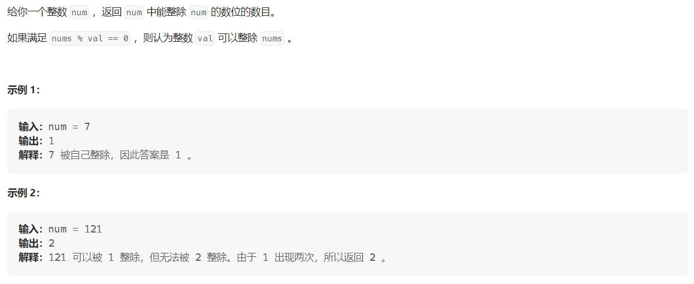
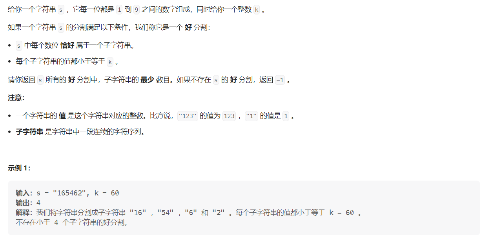

#### [2520. 统计能整除数字的位数](https://leetcode.cn/problems/count-the-digits-that-divide-a-number/)

#### 考点：模拟

#### 难度：简单

#### 题面：

#### 思路：

```java
 public int countDigits(int num) {
     int cnt = 0;
     int flag = num;
     while(num > 0){
         int tmp = num % 10;
         if(flag % tmp == 0)
             cnt ++;
         num = num/10;
     }
     return cnt;
 }
```


#### [2522. 将字符串分割成值不超过 K 的子字符串](https://leetcode.cn/problems/partition-string-into-substrings-with-values-at-most-k/)

#### 考点：贪心

#### 难度：中等

#### 题面：

#### 思路：

这题我觉得是一道贪心题，要想子字符串最少，那么每次分割的时候，尽可能往后多分割；

- 最坏的情况就是每一个数位为一个分割，因此如果不存在这样的分割，只能是存在数位`>k`，此时返回`-1`;
- 那么问题就是如何往后延伸子字符串呢？
  - 将数位转成数字`num`；
  - 使用变量`cur`记录当前的数，每次需要`cur * 10 + num`更新`cur`；
  - 如果`cur>k`，说明不能再往后延伸了，此时`ans++`，`cur=num`，比如此时`cur=165>60 num=5`，说明已经找到一个分割了，执行`ans++ cur=5`，下一步就是判断`5*10 +4`是否`<=60`；
  - 由于`cur`在不断地`*10`，而`s.length<=10^5`，因此为了防止溢出，将`cur`定义为`long`类型；
- 不要忘记最后的`ans`需要加1再返回。

```java
 public static int minimumPartition(String s, int k) {
     int ans = 0;
     // 当前的总数
     long cur = 0;
     for(int i = 0;i < s.length();i++){
         // 当前遇到的数
         int num = s.charAt(i) - '0';
         if(num > k) return -1;
         else {
             cur = cur * 10 + num;
             if(cur > k){
                 ans ++;
                 cur = num;
             }
         }
     }
     // 需要++
     return ++ans;
 }
```

