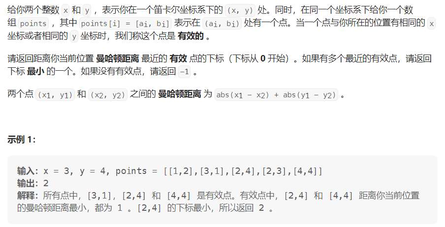

#### [1779. 找到最近的有相同 X 或 Y 坐标的点](https://leetcode.cn/problems/find-nearest-point-that-has-the-same-x-or-y-coordinate/)

#### 考点：遍历

#### 难度：中等

#### 题面：

#### 思路：

这一题也是比较简单的，直接遍历枚举所有点即可：

- 将需要返回的值ans初始设置为-1，因为题目要求，如果没有有效点，返回-1，设置为-1比较方便；
- 因为需要距离最小，因此曼哈顿距离min的初始值设为**Integer.MAX_VALUE**，或者可以根据题目给的数据大小设置；
- 遇到有效点，如果此时的距离dis小于之前维护的最小距离min，则进行dis和ans的更新，最后返回ans。
  - 这里需要注意的是，对于dis==min的情况，不需要考虑，因为是从头遍历，题目要求如果有多个有效点，返回下标最小的一个，因此一定是最先遇到，ans的值已经得到更新，所以后续遇到dis==min的情况直接跳过即可；
  - 如果没有有效点，程序不会进入if语句，ans不会更新，保持初始的-1，最后返回ans也满足题目要求——不存在有效点返回-1。

```java
public int nearestValidPoint(int x, int y, int[][] points) {
    int min = Integer.MAX_VALUE;
    int ans = -1;
    for(int i = 0;i < points.length;i++){
        int curX = points[i][0];
        int curY = points[i][1];
        if(x == curX || y == curY){
            int dis = Math.abs(x - curX) + Math.abs(y - curY);
            if( dis < min){
                min = Math.min(min, dis);
                ans = i;
            }
        }
    }
    return ans;
}
```

