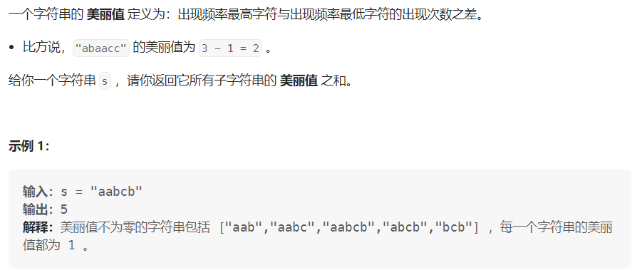

#### [1781. 所有子字符串美丽值之和](https://leetcode.cn/problems/sum-of-beauty-of-all-substrings/)

#### 考点：双重循环

#### 难度：中等

#### 题面：

#### 思路：

本题的思路就是：枚举每个子串的起始位置`i` ，找到以该起点位置的字符为左端点的所有子串，也就是再枚举终止位置`j`，计算每个子串的美丽值，最后返回累加的结果。

- **子字符串是连续的**，子序列可以不连续；
- `maxFreq`初始值设置为-1，`minFreq`初始值设置为501，因为题目给的子串的长度最大为500；
- 遍历数组`cnt`时，只有当某个字符在子串中出现，即`cnt[k]>0`的时候才进行最大频率与最小频率的更新；
- 题目给的提示是前缀和，但是官解也是双重循环暴力做法，但其实仔细想想，这种做法里面有一点点前缀和的味道?

```java
public int beautySum(String s) {
    int len = s.length();
    int ans = 0;
    //起始位置
    for(int i=0;i<len;i++){
        int cnt[] = new int[26];
        //终止位置
        for(int j=i;j<len;j++){
            cnt[s.charAt(j)-'a']++;
            int maxFreq = -1;
            int minFreq = 501;
            for(int k=0;k<26;k++){
                if(cnt[k] > 0){
                    maxFreq = Math.max(maxFreq, cnt[k]);
                    minFreq = Math.min(minFreq, cnt[k]);
                }
            }
            ans += maxFreq - minFreq;
        }
    }
    return ans;
}
```

