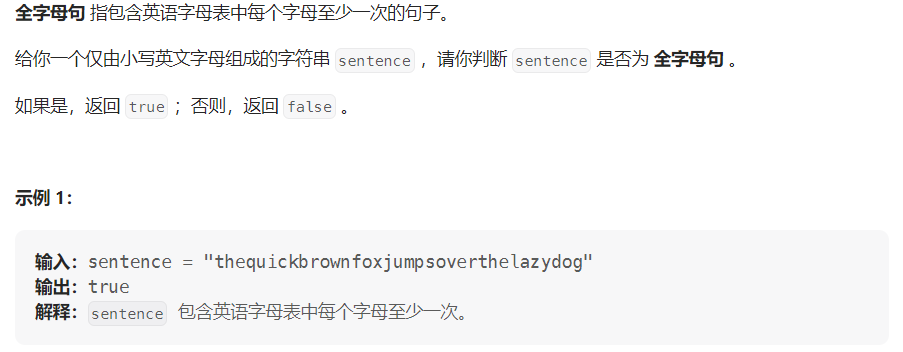

#### [1832. 判断句子是否为全字母句](https://leetcode.cn/problems/check-if-the-sentence-is-pangram/)

#### 难度：简单

#### 考点：哈希表(数组)/位运算

#### 题面：

#### 思路：

1. 这一题还是比较简单的，思路很好想：

   - 因为是判断英语字母表是否出现，因此可以定义一个**大小为26**的布尔数组来判断字母是否出现，下标0表示字母'a'，下标25表示字母'z'，初始均为false；
   - 遍历字母串，将数组中每个字符对应下标的值设置为true，表示该字符已出现过;
   - 最后遍历数组，如果存在false，表明该字符未出现过，说明该字符串不是全字母句，否则返回true。

   ```java
   public boolean checkIfPangram(String sentence) {
           boolean isExist[] = new boolean[26];
           for(int i = 0;i < sentence.length();i++){
               isExist[sentence.charAt(i)-'a'] = true;
           }
           for(boolean tmp : isExist){
               if(!tmp)
                   return false;
           }
           return true;
   }
   ```

2. 官方另一种思路——位运算

   为什么会想到位运算，因为字符集只有26个，而一个int整型变量是4个字节——32位，因此我们可以**使用一个整型变量mask来表示字符集**，即第i位对应字符集中的第i个字符——0位对应字符’a‘，25位对应’z‘。

   - 使用**左移<<**，如果字符c是字符集中的第i个字符，则将mask的第i位置1，mask的初始值为0；
   - 最后判断mask是否等于(**2^26-1**)：若字符串为全字母句，则mask的0~25位全为1，其余位为0，即mask的值应为2^26-1；
   - 这种方法不需要定义长度为26的数组，只需要一个int变量。

   ```java
   public boolean checkIfPangram(String sentence) {
           int mask = 0;
           for (int i = 0;i < sentence.length();i++){
               mask |= 1 << (sentence.charAt(i) - 'a' );
           }
           return mask == (1<<26) - 1;
   }
   ```

   