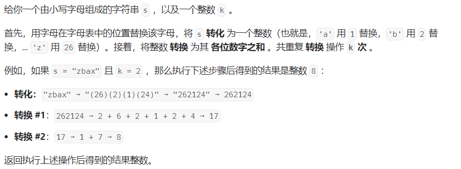

#### [1945.  字符串转化后的各位数字之和](https://leetcode.cn/problems/sum-of-digits-of-string-after-convert/)

#### 考点：

#### 难度：简单

#### 题面：

#### 思路：

这题也是比较简单，根据题目的意思模拟即可，需要考虑的一点：**若要使用Integer,valueOf()等相关API将字符串转为int时，一定要考虑字符串的长度，否则转为int可能会出现溢出的情况**。

```java
public int getLucky(String s, int k) {
    StringBuilder sb = new StringBuilder();
    for(char chr : s.toCharArray()){
        sb.append(chr - 'a' + 1);
    }
    String str = sb.toString();
    int sum = 0;
    while(k>0){
        sum = 0;
        for(int i = 0;i < str.length();i++){
            sum += str.charAt(i) - '0';
        }
        str = String.valueOf(sum);
        k--;
    }
    return sum;
}
```


