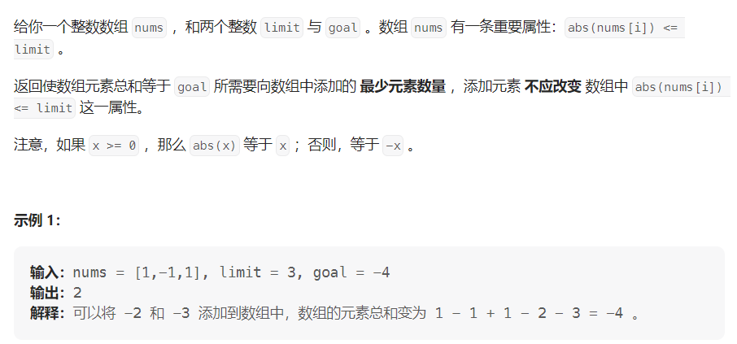

#### [1785. 构成特定和需要添加的最少元素](https://leetcode.cn/problems/minimum-elements-to-add-to-form-a-given-sum/)

#### 考点：贪心

#### 难度：中等

#### 题面：

#### 思路：

理解题意之后，认为本题是贪心，也就是先添加大的值。首先计算出数组的和与`goal`的差值，这题不用管正负，是对称的，要么全部添加正数，要么全部添加负数，因此将差值`diff`取个绝对值，以添加正数为例。我一开始是用for循环模拟贪心，代码如下：

```java
public int minElements(int[] nums, int limit, int goal) {
    int sum = Arrays.stream(nums).sum();
    int diff = Math.abs(sum - goal);
    if(diff == 0) return 0;
    int ans = 0;
    for(int i = limit;i > 0;i--){
        if(diff > 0){
            while(diff >= i){
                diff -= i;
                ans++;
            }
        }else{
            break;
        }
    }
    return ans;
}
```

上述代码无法通过测试用例75/77，显示解答错误，看完官解以及他人的解答，上述代码有两个问题：

- **注意数据范围**：`nums`数组长度的最大值为`10^5`，元素最大值为`limit`的最大值`10^6`，因此数组求和的结果最大值为`10^11`，已经超过了`int`表示的最大范围**(`Integet.MAX_VALUE=2147483647<10^11`)**，因此变量`sum`的类型应该为`long`，`diff`同样也要为`long`；
- **注意使用流求和**：因为`sum`的类型为`long`，而使用` Arrays.stream(nums).sum()`求数组和的返回值是`int`，需要使用**`Arrays.stream(nums).asLongStream().sum()`**。

但是在改完上述代码后，在最后一个用例还是超时了:dog:，所以数据量蛮大的时候，`for+while`还蛮危险的，哈哈哈。


其实仔细想想，需要添加的元素数量就为**差值`diff`除以`limit`向上取整**，上面使用for循环模拟贪心，其实就是这个思想，向上取整主要两种写法：

- **`(int) Math.ceil((double)diff/limit)`**：注意**`Math.ceil()`**里面的参数需要转`double`类型；
- **`(int) ((diff + limit -1) / limit)`**：觉得这种方法还是挺妙的，值得借鉴。

```java
public int minElements(int[] nums, int limit, int goal) {
    long sum = Arrays.stream(nums).asLongStream().sum();
    long diff = Math.abs(sum - goal);
    //return (int) Math.ceil((double)diff/limit);
    return (int) ((diff + limit -1) / limit);
}
```

做完这题，主要有以下几点收获：

- 在对数组求和时，需要注意数组和的数据范围，不要下意识就用`int`；
- 使用流等API时，也要注意各方法的返回类型；
- 向上取整的第二种方法。