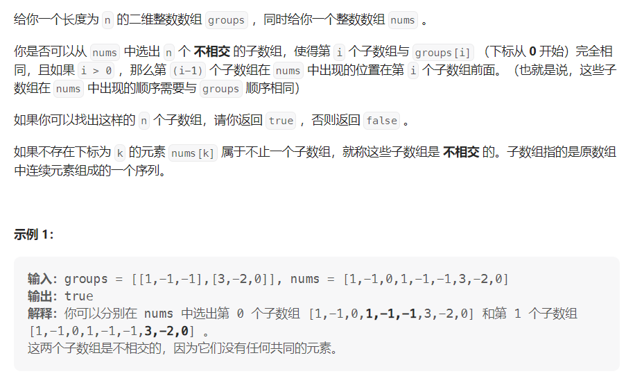

#### [通过连接另一个数组的子数组得到一个数组](https://leetcode.cn/problems/form-array-by-concatenating-subarrays-of-another-array/)

#### 考点：双指针/KMP

#### 难度：中等

#### 题面：

#### 思路：

这题感觉就是对于`groups`数组进行一行一行地匹配，使用指针`i`指向`groups`，指针`k`指向`nums`。

```JAVA
public boolean canChoose(int[][] groups, int[] nums) {
    // i指向group k指向nums
    int gLen = groups.length;
    int i = 0;
    for(int k = 0;k < nums.length && i < gLen;){
        if(check(nums,groups[i],k)){
            // 保证不相交
            k += groups[i].length;
            i++;
        }else
            k++;
    }
    return i == gLen;
}

public boolean check(int[] nums, int[] group, int k){
    // nums剩余的长度不足以匹配group
    if((k + group.length) > nums.length)
        return false;
    for(int i = 0;i < group.length;i++){
        if(group[i] != nums[k])
            return false;
        else k++;
    }
    return true;
}
```

