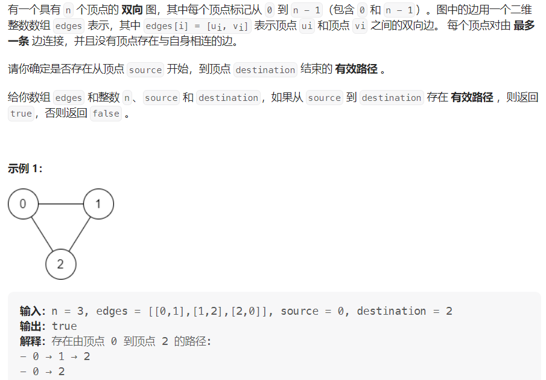

#### [1971. 寻找图中是否存在路径](https://leetcode.cn/problems/find-if-path-exists-in-graph/)

#### 考点：dfs/并查集

#### 难度：简单

#### 题面：

#### 思路：

1. **深度优先搜索dfs**

   ```java
   public boolean visited[];
   public List<Integer> graph[];
   
   public boolean validPath(int n, int[][] edges, int source, int destination) {
       visited = new boolean[n];//[0,n-1]
       graph = new List[n];
       for(int i = 0;i < n;i++)
           graph[i] = new ArrayList<>();
       for(int []edge : edges){
           int s = edge[0], d = edge[1];
           graph[s].add(d);
           graph[d].add(s);
       }
       return dfs(source, destination);
   }
   
   public boolean dfs(int source, int destination){
       if(source == destination) return true;
       visited[source] = true;
       for(int d : graph[source]){
           if(!visited[d] && dfs(d, destination))
               return true;
       }
       return false;
   }
   ```

   

2. **并查集**

   并查集的做法就等自己对

   可以先看这篇[并查集](https://blog.csdn.net/the_zed/article/details/105126583)