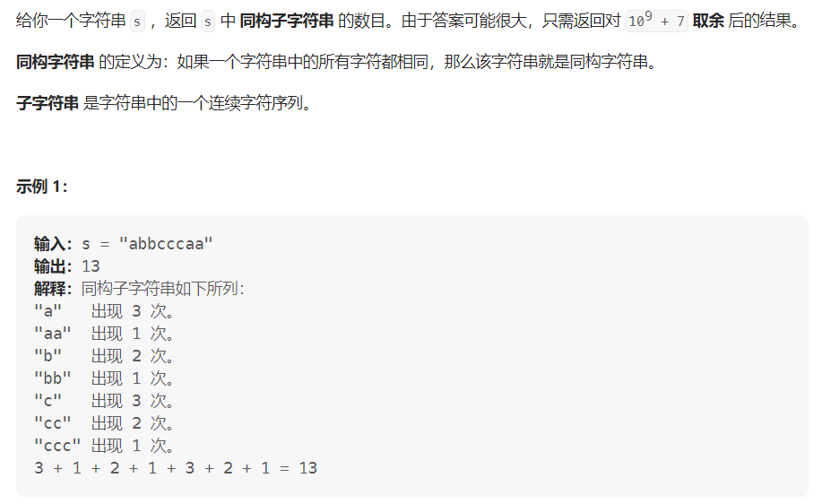

#### [1759. 统计同构子字符串的数目](https://leetcode.cn/problems/count-number-of-homogenous-substrings/)

#### 考点：数学

#### 难度：中等

#### 题面：

#### 思路：

这一题其实是一道数学题，因为同构字符串中的所有字符都相同，且子字符串是字符串中的一个**连续**字符序列，因此我们可以首先对原字符串分组，以`abbcccaa`为例，将其分成`['a','bb','ccc','aa']`，可以发现每一段的同构子字符串个数为**`1+2+..+m=m(m+1)/2`**(`m`为每一段的长度，其实是一个等差数列)，因此：

- 使用变量`cnt`统计连续相等的字符个数，当当前字符与前一个字符不相等时，将`cnt`置1，相等的话，`cnt`++；
- 最后累加即可得最终的答案。

##### Integer.MAX_VALUE=2147483647，其范围在[1e9,1e10]

```java
private final int MOD = 1000000007;
public int countHomogenous(String s) {
    //初始设置为1 因为是从第二个字符开始比较
    int ans = 1;
    // 统计连续相等的字符个数
    int cnt = 1;
    for(int i = 1;i < s.length();i++){
        if(s.charAt(i) == s.charAt(i-1)){
            cnt++;
        }else {
            cnt = 1;
        }
        // 不管相不相等，ans都需要加cnt，这样其实就是一个累加的过程，不需要进行m(m+1)/2的计算
        ans = (ans + cnt) % MOD;
    }
    return ans % MOD;
}
```

