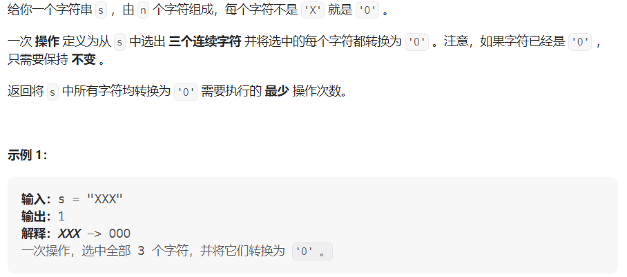

#### [2027. 转换字符串的最少操作次数](https://leetcode.cn/problems/minimum-moves-to-convert-string/)

#### 考点：贪心

#### 难度：简单

#### 题面：

#### 思路：

直接贪心，遍历字符串，遇到'X'，说明需要执行一个转换，`ans++`，同时往后移动3位。

```java
public static int minimumMoves(String s) {
    int ans = 0;
    for(int i = 0;i < s.length();i++){
        if(s.charAt(i) == 'X'){
            ans ++;
            // 由于for循环里有i++操作，因此这里只需要+2
            i += 2;
        }
    }
    return ans;
}
```

