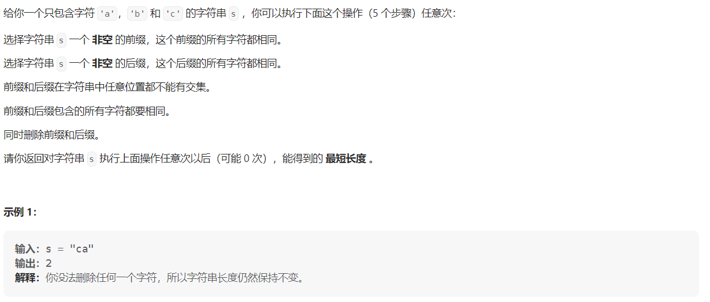

#### [1750. 删除字符串两端相同字符后的最短长度](https://leetcode.cn/problems/minimum-length-of-string-after-deleting-similar-ends/)

#### 考点：双指针

#### 难度：中等

#### 题面：

#### 思路：

这一题其实很容易想到双指针，前缀、后缀。因此可分别使用指针`i`，`j`指向字符串的开始和末尾，然后向中间移动，当`i>=j`的时候，跳出循环，同时当两个指针指向的字符不相等时，也直接跳出循环，返回答案`j-i+1`。

- 我觉得对于是`i<j`还是说`i<=j`，我们就举个例子方便自己理解，比如最外面的`while`循环，当`i=j`时，说明只剩下一个元素，已经无法删除了，此时就得跳出循环，因此`while`的条件是`i<j`；
- 最后返回`j-i+1`：
  - 当最后跳出循环时，`j>i`，此时剩余字符串的长度显然是`j-i+1`；
  - 当最后跳出循环时，`j=i`，说明此时就只剩一个字符，`j-i+1=0+1=1`符合；
  - 当最后跳出循环时，`j<i`，此时肯定有`j=i-1`，说明字符被全部删除，因此`j-i+1=i-1-i+1=0`符合。

```java
public static int minimumLength(String s) {
    int len = s.length();
    int i = 0, j = len - 1;
    //i=j跳出循环，因为就只有一个元素
    while(i < j){
        if(s.charAt(i) == s.charAt(j)){
            i++;
            j--;
            //注意是i<=j 不是i<j
            while(i <= j && s.charAt(i) == s.charAt(i-1)){
                i++;
            }
            while(i <= j && s.charAt(j) == s.charAt(j+1)){
                j--;
            }
        }else
            break;
    }
    return j - i + 1;
}
```

