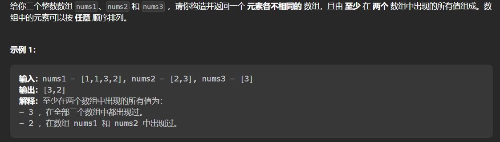

#### [2032. 至少在两个数组中存在的值](https://leetcode.cn/problems/two-out-of-three/)

#### 考点：哈希表/位运算

#### 难度：简单

#### 题面：

#### 思路：

1. **哈希表**

   这题一开始本来想用`set`，后来看了眼数据范围——`1<=nums1[k]<=100`，因此选择使用数组。

   - 定义一个长度为101的数组`nums`，`nums[i]`表示`i`在几个数组中出现过；
   - 数组`flag`是用来去重的，即对于一个数组中重复出现的数字只统计一次，但需要注意的是，每次遍历新数组时，`flag`需要重置；
   - 最后遍历数组`nums`，将`>=2`的数字添加至答案中。

   ```java
   public List<Integer> twoOutOfThree(int[] nums1, int[] nums2, int[] nums3) {
       List<Integer> ans = new ArrayList<>();
       int nums[] = new int[101];
       boolean flag[] = new boolean[101];
       for(int num : nums1){
           if(!flag[num]){
               nums[num]++;
               flag[num] = true;
           }
       }
       Arrays.fill(flag, false);
       for(int num : nums2){
           if(!flag[num]){
               nums[num]++;
               flag[num] = true;
           }
       }
       Arrays.fill(flag, false);
       for(int num : nums3){
           if(!flag[num]){
               nums[num]++;
               flag[num] = true;
           }
       }
       for(int i = 1;i <= 100;i++){
           if(nums[i] >= 2)
               ans.add(i);
       }
       return ans;
   }
   ```

   参考[ylb的解法](https://leetcode.cn/problems/two-out-of-three/solutions/2036086/by-lcbin-4pww/)：

   - 定义三个数组`s1`、`s2`、`s3`，遍历`nums1`、`nums2`、`nums3`时，某个数字出现，执行**`s1[i]=1`**，这样实际上执行了去重操作，哪怕某个数字`i`多次出现，`s1[i]=1`；
   - 最后执行判断`s1[i] + s2[i] + s3[i] >= 2`，若符合，则添加至答案中。

   ```java
    public List<Integer> twoOutOfThree(int[] nums1, int[] nums2, int[] nums3) {
        int[] s1 = get(nums1), s2 = get(nums2), s3 = get(nums3);
        List<Integer> ans = new ArrayList<>();
        for (int i = 1; i <= 100; ++i) {
            if (s1[i] + s2[i] + s3[i] >= 2) {
                ans.add(i);
            }
        }
        return ans;
    }
   
   private int[] get(int[] nums) {
       int[] s = new int[101];
       for (int num : nums) {
           s[num] = 1;
       }
       return s;
   }
   
   ```

2. **位运算**

   感觉位运算我确实想不到

   参考[道哥刷题](https://leetcode.cn/problems/two-out-of-three/solutions/2036227/by-lcfgrn-39vx/)

   ```java
   public List<Integer> twoOutOfThree(int[] nums1, int[] nums2, int[] nums3) {
       List<Integer> ans = new ArrayList<>();
       int[] cnt = new int[101];
       for(int x : nums1) cnt[x] |= 1;
       for(int x : nums2) cnt[x] |= 2;
       for(int x : nums3) cnt[x] |= 4;
       for(int i = 1; i <= 100; i++) {
           int x = cnt[i];
           if((x & (x - 1)) > 0) ans.add(i);
       }
       return ans;
   }
   ```

   

   

