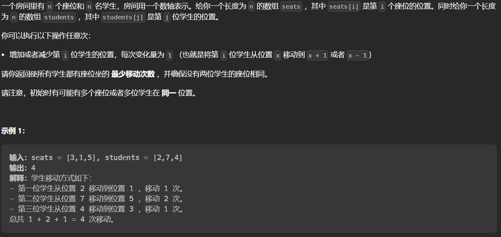

#### [2037. 使每位学生都有座位的最少移动次数](https://leetcode.cn/problems/minimum-number-of-moves-to-seat-everyone/)

#### 考点：排序

#### 难度：简单

#### 题面：

#### 思路：

首先将数组`seats`和`students`排序

```java
public int minMovesToSeat(int[] seats, int[] students) {
    Arrays.sort(seats);
    Arrays.sort(students);
    int ans = 0;
    for(int i = 0;i < seats.length;i++)
        ans += Math.abs(seats[i] - students[i]);
    return ans;        
}
```

