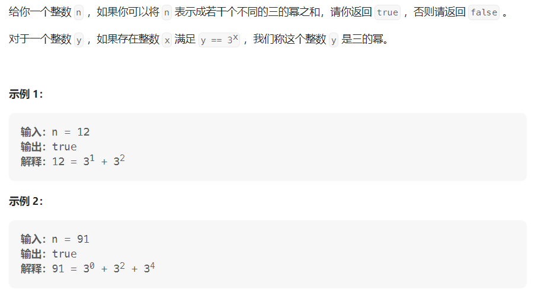

#### **[1780. 判断一个数字是否可以表示成三的幂的和](https://leetcode.cn/problems/check-if-number-is-a-sum-of-powers-of-three/)**

#### 难度：中等

#### 考点：三进制

#### 题面：



#### 思路：

1. 官方思路——**三进制**

   - 转化为3进制后，每一位必须是0或1，出现2的话返回false；
   - 仔细想想，这道题应该要想到进制，毕竟题解的解释应该会让你想到二进制，而对于三进制，就是对n进行**除3取余**操作
   - 举个例子：
     - 12的3进制表示为(110)，符合题意，返回true；
     - 21 = 2*3^2 + 3^1，即3进制表示为(210)，其中出现了2，不符合题意，返回false。

   ```java
   public boolean checkPowersOfThree(int n){
           while(n>0){
               if(n%3 == 2) return false;
               else
                   n = n/3;
           }
           return true;
   }
   ```

2. **深度优先搜索dfs** 

   我做这题的时候根本没有想到官方的三进制写法，之前也没有做过类似的题，自己想到的就是搜索。题目要求的是不同的三的幂之和，注意了一下n的范围1<n<1e7，其实不算大，3的15次方就已经比1e7要大了，因此总共可供选择的只有15个，即**3^0~3^14**，开始写dfs代码：

   - 使用options[]数组存储可供选择的3的幂；
   - 当此时的sum与n相等时，即说明找到了一种组合方式，return true；
   - 剪枝：当此时的sum>target时，直接return false；
   - 因为题目要求的每个3的幂只能选择一次，因此for循环遍历中dfs的下一个下标是**i+1**。

   最终确实是通过了，但是耗时比较久(:dog:)。

   ```java
   public boolean checkPowersOfThree(int n) {
           int options[] = new int[15]; //pow(3,15)>1e7
           for(int i=0;i<15;i++)
               options[i] = (int)Math.pow(3,i);
           return dfs(options,0,n,0);
   }
   
   public boolean dfs(int options[], int sum, int target, int start){
           if(sum == target) return true;
           if(sum > target) return false; //剪枝
           for(int i=start;i<options.length;i++){
               if(dfs(options, sum+options[i], target, i+1))
                   return true;
           }
           return false;
   }
   ```

3. **回溯**

   回溯的思路其实和dfs基本相同，毕竟回溯就是一个dfs的过程

   - 使用[代码随想录](https://www.programmercarl.com/)提供的[回溯算法模板](https://programmercarl.com/%E5%9B%9E%E6%BA%AF%E7%AE%97%E6%B3%95%E7%90%86%E8%AE%BA%E5%9F%BA%E7%A1%80.html#%E9%A2%98%E7%9B%AE%E5%88%86%E7%B1%BB%E5%A4%A7%E7%BA%B2%E5%A6%82%E4%B8%8B);
   - 同样需要剪枝，即sum>target时直接return false;
   - 当sum==target时，说明找到了一种组合方式，将path添加至res中，最终return res.size()>0。

   ```java
    List<Integer> path = new ArrayList<>();
    List<List<Integer>> res = new ArrayList<>();
   
    public boolean checkPowersOfThree4(int n) {
           int options[] = new int[15]; //pow(3,15)>1e7
           for(int i=0;i<15;i++)
               options[i] = (int)Math.pow(3,i);
           backtrack(options,0,n,0);
           return res.size()>0;
   }
   
   public void backtrack(int options[], int sum, int target, int start){
           if(sum == target) {
               res.add(new ArrayList<>(path));
               return;
           }
           if(sum > target) return;
           for(int i=start;i<options.length;i++){
               //处理节点
               sum = sum + options[i];
               path.add(options[i]);
               //递归
               backtrack(options, sum, target,i+1); 
               //回溯
               path.remove(path.size()-1);
               sum = sum - options[i];
           }
   }
   ```

4. **动态规划**

   这题我想着想着就把它转换成了一个01**背包问题**，将问题转化成——"**背包容量为n，物品的体积分别为3^0~3^14，每个物品只能放一次，问是否可以将背包装满**"，也让我想到之前做过的一题[416.分割等和子集](https://leetcode.cn/problems/partition-equal-subset-sum/)，分析一下其实是一样一样的。由于数据规模的问题，这个代码没有AC，在第120/129个样例超时了。

   ```java
   public boolean checkPowersOfThree(int n){
           int len = 15;
           int options[] = new int[len]; //pow(3,15)>1e7
           for(int i=0;i<len;i++)
               options[i] = (int)Math.pow(3,i);
           int dp[] = new int[n + 1];
           for(int i=0;i<len;i++){
               for(int j=n;j>=options[i];j--)
                   dp[j] = Math.max(dp[j], dp[j-options[i]]+options[i]);
           }
           return dp[n] == n;
   }
   ```

