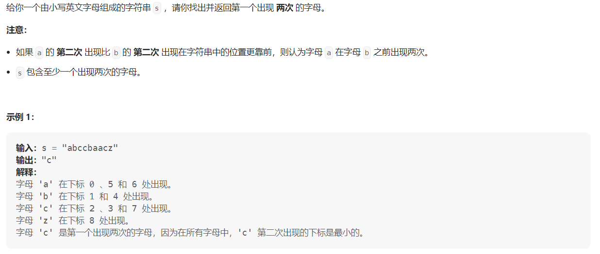

#### [2351. 第一个出现两次的字母](https://leetcode.cn/problems/first-letter-to-appear-twice)

#### 考点：哈希表/位运算

#### 难度：简单

#### 题面：



#### 思路：

##### 1. 哈希表(数组)

这种题也是非常常见，只包含小写字母，因此就可以定义一个长度为26位的数组存储字母出现的次数。

因为题目保证`s`至少包含一个出现两次的字母，因此最终随意`return`一个字符即可，因为程序一定会在`for`循环内部终止。

```java
public char repeatedCharacter(String s) {
    int cnt[] = new int[26];
    for(char chr : s.toCharArray()){
        if(++cnt[chr - 'a'] == 2)
            return chr;
    }
    // 随意返回一个字符即可
    return 'a';
}
```

##### 2. 位运算

感觉这种可以使用长度为26的数组解决的简单题，一般都可以用位运算解决，定义一个32位的`int`变量。

```java
 public char repeatedCharacter(String s) {
     int mask = 0;
     for(char chr : s.toCharArray()){
         int tmp = 1 << (chr - 'a');
         if((mask & tmp) != 0) return chr;
         mask |= tmp;
     }
     return 'a';
 }
```

