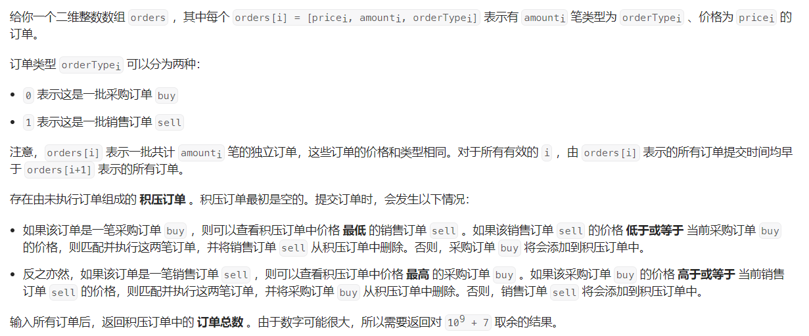

#### [1801. 积压订单中的订单总数](https://leetcode.cn/problems/number-of-orders-in-the-backlog/)

#### 考点：优先队列 + 模拟

#### 难度：中等

#### 题面：

#### 思路：

这题其实如果想到**优先队列**的话，就不是很难了，就是一个根据题意模拟的过程。

我一开始想的是队列，但是根据题意，每次需要查询最低的销售订单或者最高的采购订单，这意味着需要对队列排序，因此就可以想到使用优先队列。

- 对于采购订单，由于每次查看价格最高的，因此使用**大根堆**，`lambda`表达式；
- 对于销售订单，由于每次查看价格最低的，因此使用**小根堆**；
- 对于堆里面存放的元素，一开始直接存`price`，但由于`amount`的范围会导致超出内存限制，后来想到使用`map`，但其实使用一个长度为2的数组就行，其中`array[0]`为价格，`array[1]`为数量；
- 遍历`orders`数组，按照每个订单的`type`根据题意模拟，需要注意的地方：
  - 在访问优先队列中的元素，首先要保证其不为空，在本题`amount>0`优先级最大，因为只有`amount>0`才会去访问堆，因此放在`while`循环的最前面；
  - 自认为是小技巧：先讲堆顶的订单全部取出，若没有全部删完，再将剩余的订单加入堆中；
- `ans`设置为`long`类型，防止溢出，但其实设置为`int`也可以，那就需要在`while`循环里每次更新`ans`时去`%MOD`，即`ans = (ans + buyPQ.peek()[1]) % MOD`。

```java
private final int MOD = (int) (1e9 + 7);
public int getNumberOfBacklogOrders(int[][] orders) {
    /**
     * 采购订单放置大根堆
	 * 销售订单放置小根堆
     * 堆里面的元素是长度为2的数组 array[0] = price  array[1] = amount 不需要使用map
    */
    PriorityQueue<int[]> buyPQ= new PriorityQueue<>((o1, o2) -> (o2[0] - o1[0]));
    PriorityQueue<int[]> sellPQ = new PriorityQueue<>((o1, o2) -> (o1[0] - o2[0]));
    for(int[] order : orders){
        int price = order[0];
        int amount = order[1];
        int type = order[2];
        if(type == 0) {
            // 当前是采购订单
            while(amount > 0 && !sellPQ.isEmpty() && sellPQ.peek()[0] <= price){
                // 删除销售订单
                int[] sell = sellPQ.poll();
                int p = sell[0], a = sell[1];
                if(a > amount){
                    // 会将采购订单全部删除 如果采购数量不够删除销售订单 则将剩余的销售订单加入队列
                    sellPQ.add(new int[]{p, a - amount});
                    amount = 0;
                }else {
                    amount -= a;
                }
            }
            // 将剩余的采购订单添加至积压订单
            if(amount > 0){
                buyPQ.add(new int[]{price, amount});
            }
        }else{
            // 当前是销售订单
            while(amount > 0 && !buyPQ.isEmpty() && buyPQ.peek()[0] >= price){
                // 删除采购订单
                int buy[] = buyPQ.poll();
                int p = buy[0], a = buy[1];
                if(a > amount){
                    buyPQ.add(new int[]{p, a - amount});
                    amount = 0;
                }else {
                    amount -= a;
                }
            }
            if(amount > 0){
                sellPQ.add(new int[]{price, amount});
            }
        }
    }
    long ans = 0;
    while(!buyPQ.isEmpty()){
        ans += buyPQ.peek()[1];
        buyPQ.poll();
    }
    while(!sellPQ.isEmpty()){
        ans += sellPQ.peek()[1];
        // ans = (ans + buyPQ.peek()[1]) % MOD 如果把ans定义成这样
        sellPQ.poll();
    }

    return (int) (ans % MOD);
}
```

