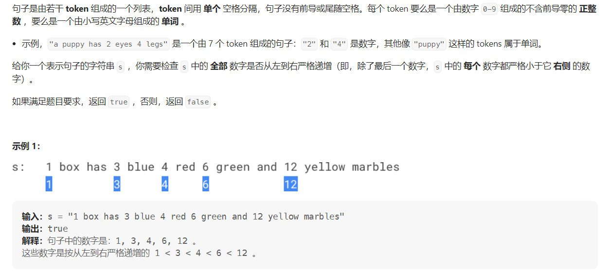

#### [2042. 检查句子中的数字是否递增](https://leetcode.cn/problems/check-if-numbers-are-ascending-in-a-sentence/)

#### 考点：模拟

#### 难度：简单

#### 题面：

#### 思路：

这题就是一道模拟题。

- 首先讲字符串`s`根据空格分割，使用`spilt()`函数；
- 预定义变量`pre=-1`表示前一个数字，`cur`表示当前数字，由于`s`中数字`token`的范围在2到100，因此将`pre`的值定义为-1，其实小于2就可以；
- 遍历分割得到列表中的每一个`token`，由于不会有数字和字母混合出现的`token`，因此可以通过判断每个`token`的第一个字符来确定此`token`是不是数字`token`，如果是，则将其转化成数字赋值给`cur`，由于`token`的范围是2到100，因此直接使用`Integer.parseInt`转换不会有溢出的问题。然后与`pre`比较，如果小于等于`pre`，说明不是严格递增，返回`false`，否则将`pre`的值更新为`cur`(**边遍历边比较**)；
- 如果能执行完`for`循环，则说明是严格递增的，返回`true`。

```java
public boolean areNumbersAscending(String s) {
    String[] words = s.split(" ");
    int pre = -1, cur = 0;
    for(String word : words){
        if(Character.isDigit(word.charAt(0))){
            cur = Integer.parseInt(word);
            if(cur <= pre) return false;
            else pre = cur;
        }
    }
    return true;
}
```

在看别人题解的时候，发现了一个很有意思的处理方式，使用`try catch`。

因为如果`word`不是数字`token`，直接使用`Integer.parseInt`处理是会报错的，因此可以使用`try catch`来捕获这个异常，这样就不需要判断此`token`是不是数字`token`，直接转化即可。

```java
public boolean areNumbersAscending2(String s) {
    String[] words = s.split(" ");
    int pre = -1, cur = 0;
    for(String word : words){
        try {
            cur = Integer.parseInt(word);
            if(cur <= pre) return false;
            else pre = cur;
        }catch (Exception e){};
    }
    return true;
}
```

