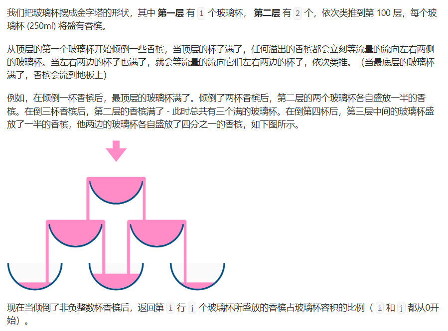

#### [799. 香槟塔](https://leetcode.cn/problems/champagne-tower/)

#### 考点：动态规划

#### 难度：中等

#### 题面：

#### 思路：

这一题其实还挺有意思的，为什么会想到动态规划呢——理解题意后，会发现**每一个香槟杯中的香槟只会来自于上一层的上方和左上方的杯子**

- 使用`dp[i][j]`表示第`i`行第`j`列杯子中的香槟容量，香槟只会来源于`dp[i-1][j]`和`dp[i-1][j-1]`;
- **因为只有上一层中杯子的香槟满出来(>1)才会流到下一层**，因此状态转移方程为` dp[i][j] = Math.max(dp[i-1][j]-1,0)/2 + Math.max(dp[i-1][j-1]-1,0)/2`;
- 为了防止越界，将`dp`数组的大小设置为`double[query_row+2][query_row+2]`，同时**先把所有香槟全部倒入最上层杯子**，为了方便，这边最上层杯子的下标为`[1,1]`，然后计算`dp`数组的计算；
- 最后返回待查询杯子中的香槟容量，但一定要注意返回的最大值为1。

```java
 public double champagneTower(int poured, int query_row, int query_glass) {
     /**
         * dp[i][j] 表示某个杯子中的香槟容量
         * 每一个香槟杯的香槟只会来自于dp[i-1][j]  dp[i-1][j-1]
         */
     double dp[][] = new double[query_row+2][query_row+2];
     //先把所有香槟全部倒入最上层杯子
     dp[1][1] = poured;
     for(int i=2;i<=query_row+1;i++){
         for(int j=1;j<=i;j++){
             //上一层的杯子得溢出来才会流到下一层
             dp[i][j] = Math.max(dp[i-1][j]-1,0)/2 + Math.max(dp[i-1][j-1]-1,0)/2;
         }
     }
     //返回值最大为1
     return Math.min(dp[query_row+1][query_glass+1],1);
}
```

