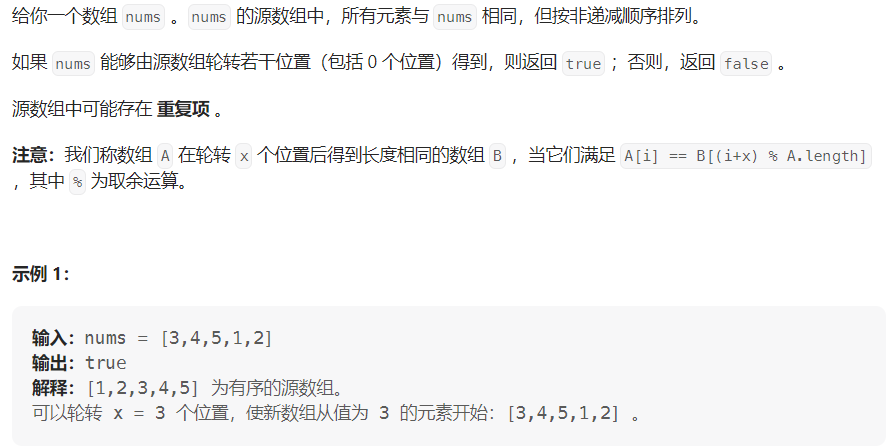

#### [1752. 检查数组是否经过排序和轮转得到](https://leetcode.cn/problems/check-if-array-is-sorted-and-rotated/)

#### 考点：遍历

#### 难度：简单

#### 题面：

#### 思路：

**不满足的情况很多，因此可以从满足的情况考虑**，符合题意的数组只有两种情况：

1. `nums`本身就非递减；
2. 从前往后遍历，`nums`只会有一次递减，同时`nums[0]>=nums[length-1]`。


因此，可使用变量`cnt`来统计递减的次数

- `cnt=0`，说明`nums`本身就非递减，符合要求，返回`true`；
- `cnt>=2`，肯定不符合要求，返回`false`；
- `cnt=2`，只有满足`nums[0]>=nums[length-1]`才返回`true`，否则返回`false`。

```java
public boolean check(int[] nums) {
    int len = nums.length;
    if(len==1) return true;
    //统计递减的次数
    int cnt = 0;
    for(int i=1;i<len;i++){
        if(nums[i]<nums[i-1])
            cnt++;
    }
    if(cnt==0) return true;
    else if(cnt>=2) return false;
    return nums[0]>=nums[len-1];
}
```

