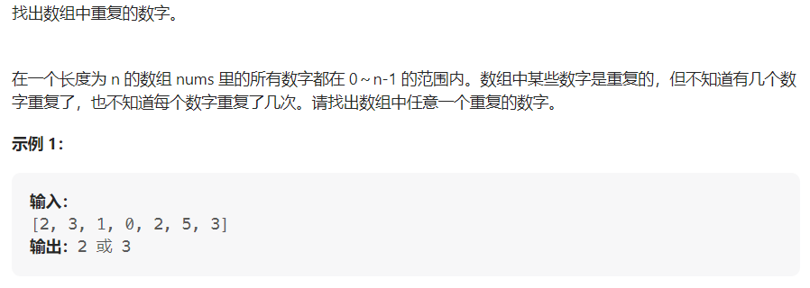

#### [剑指 Offer 03. 数组中重复的数字](https://leetcode.cn/problems/shu-zu-zhong-zhong-fu-de-shu-zi-lcof/)

#### 难度：简单

#### 考点：哈希表

#### 题面：

#### 思路：

1. **哈希表**

   这一题想到哈希表应该挺好想到的，可以使用map或者set，我用的是map，但感觉set更好想一些(:dog:)，毕竟set具有没有重复元素的特性

   - map的key记录的是nums[i]，value记录hums[i]出现的次数，~~**当map中存在key的value>1，说明有重复元素**~~；
   - ~~遍历数组，**先执行put操作**，再查询该数的次数是否大于1，如果大于，直接return nums[i]；~~
   - 使用**map.containsKey()方法**判断map中是否已经包含此数字，如果包含，直接返回；(一开始做没有想起来map有这个方法:cry:)
   - 因为题目提供的数据样例肯定都是有重复数字的，因此最后return任意一个值，我选择的是-1；
   - 如果是用的是set，set也提供了对应方法**contains**，则可使用**set.contains(key)方法**来判断。

   ```java
   public int findRepeatNumber(int[] nums) {
       Map<Integer,Integer> map = new HashMap<>();
       for(int i = 0;i < nums.length;i++){
           // 先put再查询
           if(map.containsKey(nums[i])) return nums[i];
           map.put(nums[i], map.getOrDefault(nums[i],0) + 1);
           // if(map.get(nums[i]) > 1) return nums[i];
       }
       return -1;
   }
   ```

2. **原地交换**