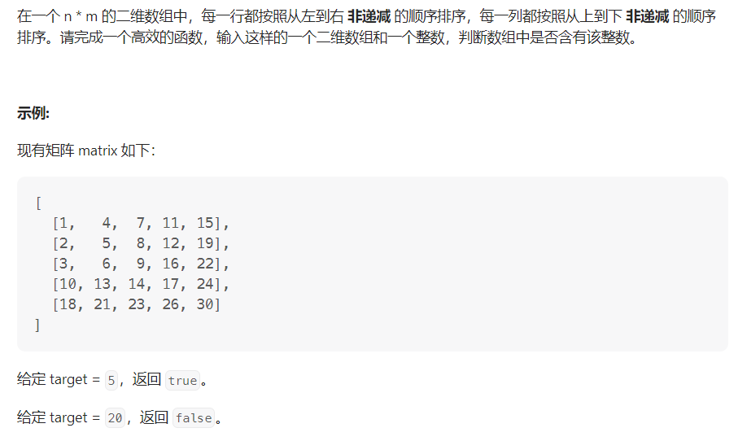

#### [剑指Offer04.  二维数组中的查找](https://leetcode.cn/problems/er-wei-shu-zu-zhong-de-cha-zhao-lcof/)

#### 考点：查找

#### 难度：中等

#### 题面：

#### 思路：

1. 直接遍历，时间复杂度**O(mn)**

```java
public boolean findNumberIn2DArray(int[][] matrix, int target) {
    for (int[] row : matrix) {
        for (int element : row) {
            if (element == target) {
                return true;
            }
        }
    }
    return false;
}
```

2. **对每一行进行二分查找**，时间复杂度**O(nlogm)**

```java
public boolean findNumberIn2DArray(int[][] matrix, int target) {
    for (int[] row : matrix) {
        int index = search(row, target);
        if (index >= 0) {
            return true;
        }
    }
    return false;
}

public int search(int[] nums, int target) {
    int low = 0, high = nums.length - 1;
    while (low <= high) {
        int mid = (high - low) / 2 + low;
        int num = nums[mid];
        if (num == target) {
            return mid;
        } else if (num > target) {
            high = mid - 1;
        } else {
            low = mid + 1;
        }
    }
    return -1;
}
```

3. **Z字形查找**

参考[题解](https://leetcode.cn/problems/er-wei-shu-zu-zhong-de-cha-zhao-lcof/solutions/95306/mian-shi-ti-04-er-wei-shu-zu-zhong-de-cha-zhao-zuo/)

官方题解将这种做法称为"Z字形查找"，虽然不知道为啥，但是觉得这种方法很巧妙，利用了此数组"**每一行从左到右非递减，每一列从上到下非递减**"的特性。

- 从**左下角**开始查找，即`i = matrix.length - 1`,` j = 0`；
- 对于每一个查找到的元素，判断其与`target`的大小关系：
  - **大于`target`：**说明 `target`  一定在此时访问元素所在**行的上方** ，当前所在行可被消去，执行`i--`操作；
  - **小于`target`：**说明 `target`  一定在此时访问元素所在**列的右方**，当前所在列可被消去，执行`j++`操作；
  - **等于`target`：**说明数组中包含`target`，返回`true`。
- 终止条件为下标`i`, `j`不能越界。

```java
public boolean findNumberIn2DArray(int[][] matrix, int target) {
    // 从左下角开始查找
    int i = matrix.length - 1, j = 0;
    while(i >= 0 && j < matrix[0].length){
        if(matrix[i][j] > target){
            i--;
        }else if(matrix[i][j] < target){
            j++;
        }else
            return true;
    }
    return false;
}
```

- 从**右上角**开始查找
- 整体思路与从左上角开始查找一致，但此时需要首先判断数组是否为空，因为当数组为空时，访问`matrix[0].length`会报空指针异常的错误
- 对于每一个查找到的元素，判断其与`target`的大小关系：
  - **大于`target`：**说明 `target`  一定在此时访问元素所在**列的左方** ，当前所在列可被消去，执行`j--`操作；
  - **小于`target`：**说明 `target`  一定在此时访问元素所在**行的下方**，当前所在行可被消去，执行`i++`操作；
  - **等于`target`：**说明数组中包含`target`，返回`true`。
- 终止条件为下标`i`, `j`不能越界。

```java
public boolean findNumberIn2DArray(int[][] matrix, int target) {
    // 判断数组是否为空
    if(matrix.length == 0) return false;
    // 从右上角开始查找
    int i = 0, j = matrix[0].length - 1;
    while(i < matrix.length && j >= 0){
        if(matrix[i][j] > target){
            j--;
        }else if(matrix[i][j] < target){
            i++;
        }else
            return true;
    }
    return false;
}
```