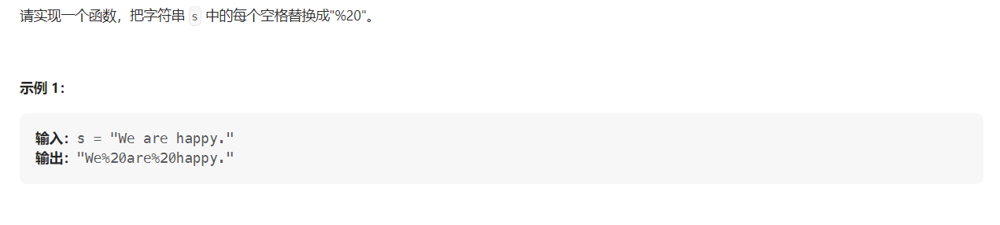

#### [剑指Offer5. 替换空格](https://leetcode.cn/problems/ti-huan-kong-ge-lcof/)

#### 考点：模拟

#### 难度：简单

#### 题面：

#### 思路：

在`Java`语言中，字符串是不可变类型，因此无法直接修改字符串中的某个字符，需要新建一个字符串实现，但是在`C++`语言中，`string`类型是可变的，因此可以原地修改。

1. **`Java`**

   ```java
   //直接使用函数replace()
   public String replaceSpace(String s) {
       return s.replace(" ","%20");
   }
   ```

   ```java
   public String replaceSpace(String s) {
       StringBuilder sb = new StringBuilder();
       for(char chr : s.toCharArray()){
           if(chr ==' ')
               sb.append("%20");
           else
               sb.append(chr);
       }
       return sb.toString();
   }
   ```

2. `C++`

   ```c++
   string replaceSpace(string s) {
       int count = 0, len = s.size();
       for(char c : s){
           if(c == ' ')
               count++;
       }
       //resize修改原字符串长度
       s.resize(len + 2*count);
       //注意要倒序修改
       for(int i = len-1, j = s.size()-1;i < j;i--,j--){
           if(s[i] != ' '){
               s[j] = s[i];
           }else{
               s[j] = '0';
               s[j-1] = '2';
               s[j-2] = '%';
               j = j-2;
           }
       }
       return s;
   }
   ```

   

